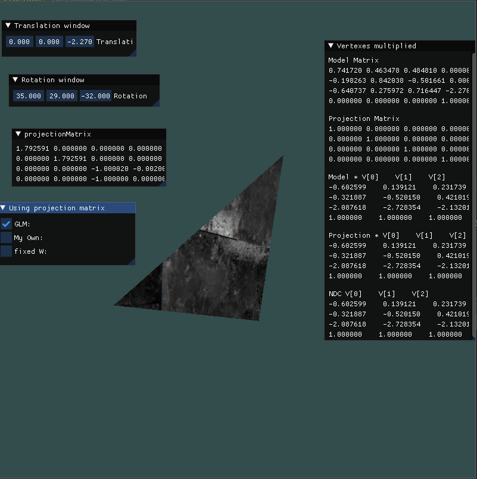

## OpenGL Template Project
This is a simple OpenGL project template that uses GLFW, GLEW, ImGui, and glm libraries. It demonstrates how to set up a window, load shaders, create a triangle, and manipulate a 3D object. This project is perfect for getting started with OpenGL and serves as a great base for future OpenGL projects.





#### Table of Contents: 
 - Features
 - Requirements
 - Setup
 - Project Structure
 - ToDo
 - License

### Features
 - Basic GLFW window creation
 - GLEW initialization for OpenGL functions
 - ImGui integration for GUI elements
 - GLM library for mathematical operations
 - Shader loading and compilation
 - Texture loading using STB Image
 - Simple geometry management
 - Object transformations (translation and rotation)


### Requirements
To compile and run this project, you will need:

* CMake and make
* C++11 compatible compiler
* GLFW3
* GLEW
* glm
* [ImGui](https://github.com/ocornut/imgui) library (included)
* [STB Image library](https://github.com/nothings/stb) (included)

### Setup
Clone this repository.

Run dependency.sh (For Arch linux, Debian, CentOS and MacOS users) to install libs:
```bash
./dependency.sh
```

Build project and copy shaders and texture example to build directory 
```bash
mkdir build 
cd build
cmake ..
make -j8
cp -r ../shaders .
cp ../texture.jpeg .
```

Run
```bash
./opengl-sample
```

### Project Structure
* Window.hpp: Contains the Window class, which is responsible for creating and managing the GLFW window, initializing GLEW, ImGui, and OpenGL viewport.
* Shader.cpp: Contains the Shader and ShaderProgram classes, which are responsible for loading, compiling, and linking shaders.
* GeometryKeeper.hpp: Contains the GeometryKeeper class, which is responsible for managing geometry buffers and creating instances of 3D objects.
* Object3D.hpp: Contains the Object3D class, which represents a 3D object with its geometry, texture, and transformation matrices.
* Texture.cpp: Contains the Texture class, which is responsible for loading textures using STB Image library and managing their OpenGL state.

### ToDo
1. [ ] JSON-based resource loader
2. [*] Keys handler
3. [*] Camera
4. [ ] Mouse picking
5. [ ] Phong lighting
6. [ ] Normal mapping
7. [ ] Animation
8. [ ] Text rendering

### License
This project is open-source and available under the MIT License. Feel free to use it as a starting point for your OpenGL projects.
